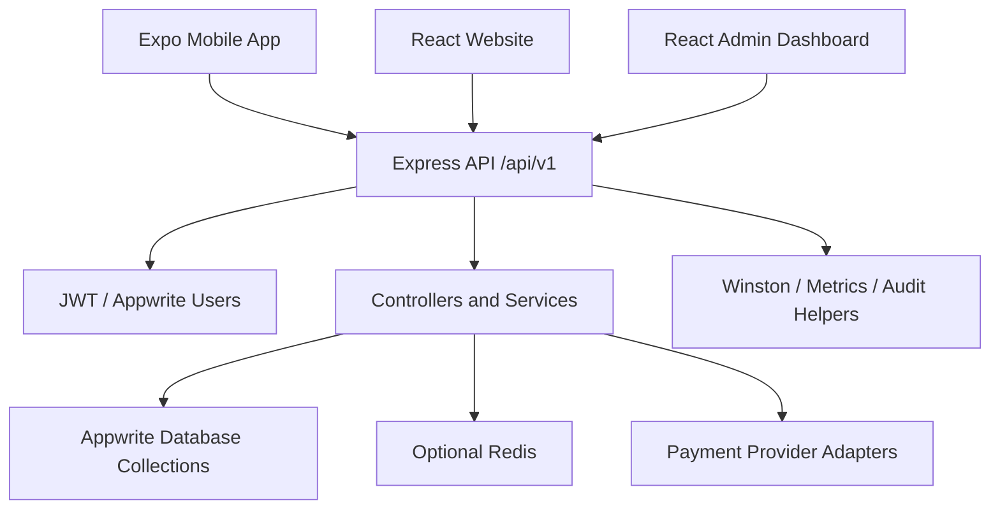
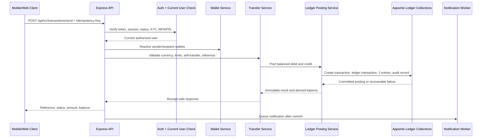

# AfraPay Phase 1 Wallet System
## Technical Assessment and Implementation Strategy

**Assessment date:** 2026-09-03  
**Scope:** `backend/`, `MobileApp/`, `Website/`, `AdminDashboard/`, Appwrite setup/diagnostic scripts, and repository documentation.  
**Assessment basis:** Source inspection. No production Appwrite data, deployed configuration, provider credentials, or runtime traffic were assumed.

## 1. Executive Summary

AfraPay has a useful application foundation: a versioned Express API, Appwrite persistence, Expo mobile client, React web client, admin client, authentication flows, role middleware, validation, rate limiting, structured logging, payment-provider adapters, and transaction screens. This is a credible MVP platform shell.

It is **not yet ready to host a production wallet ledger**. The current wallet implementation stores and mutates numeric balances directly in Appwrite documents. Internal transfers perform separate transaction creation, sender debit, receiver credit, and completion updates. There are no ledger accounts, immutable ledger transactions, debit/credit entries, posting rules, balance reconciliation, or atomic financial commit boundary. A failed receiver credit can leave the sender debited and only mark the transaction `reversal_pending`; no reconciliation implementation was found.

The Phase 1 decision should therefore be:

> **Proceed with a ledger subsystem inside the existing monolithic backend, but do not expose production internal transfers until ledger posting, idempotency, authorization freshness, reconciliation, and failure testing pass.**

Overall readiness for ledger-backed wallet launch: **CRITICAL**. Overall readiness for continued platform development: **NEEDS IMPROVEMENT**.

The highest-priority blockers are:

- Direct mutable balance writes in `secureTransactionController.js`, `walletTransferService.js`, `walletService.js`, and payment flows.
- No double-entry tables or ledger posting service.
- No multi-document atomicity in Appwrite; current compensation is incomplete.
- JWT claims are accepted without reloading current user status, KYC, role, MFA, and token version.
- Redis idempotency is effectively not wired: the middleware imports `createClient`, but `database/connection.js` does not export it. Production falls back to process-local memory unless separately corrected.
- The authentication report claims fixes that are not fully reflected in the active source, including session route stubs and the missing user reload.
- No meaningful automated backend or frontend tests were found for financial correctness.

## 2. Current Platform Assessment

| Area | State | Evidence and assessment |
|---|---|---|
| Repository organization | NEEDS IMPROVEMENT | Clear top-level separation, but duplicated/parallel projects (`admin-dashboard` and `AdminDashboard`), legacy `backend/services/appwriet.js`, duplicate auth/router surfaces, and source/documentation drift increase review risk. |
| Backend architecture | NEEDS IMPROVEMENT | Express route/controller/service structure is recognizable and reusable. Financial logic is spread across payment controllers, secure transaction controllers, wallet services, and legacy paths rather than one authoritative money-movement domain. |
| Mobile application | NEEDS IMPROVEMENT | Expo Router, SecureStore, wallet hooks, dashboard, send-money, transaction list/detail, pagination, and retry UI exist. Errors are sometimes swallowed; there is no explicit connectivity state or automated tests. |
| Website | NEEDS IMPROVEMENT | Cookie-oriented auth, protected routes, wallet and send-money screens, history, receipt/detail components, and responsive React UI exist. Network errors can log users out and transaction response-shape handling is inconsistent. |
| Admin dashboard | NEEDS IMPROVEMENT | Protected operational screens, query/polling, filtering, export, and transaction detail exist. The API fallback contains malformed `hhttps://`; bearer/refresh tokens are stored in browser-readable storage. |
| API structure | NEEDS IMPROVEMENT | `/api/v1` is registered with broad feature coverage. `/payments/*` and `/transactions/*` overlap, and the public `/api/v1/test-register` route echoes request data. Required wallet contract is not cleanly represented as `/wallet/*`. |
| Database readiness | CRITICAL for wallet | Appwrite collections exist or are configured for users, wallets, transactions, payments, merchants, payouts, audit logs, etc. No ledger schema exists. Appwrite lacks the required cross-document ACID transaction boundary for the current design. |
| Authentication | NEEDS IMPROVEMENT | JWT verification, cookies on web, SecureStore on mobile, password hashing, email verification, MFA scaffolding, and rate limiting exist. Active middleware does not reload users; SMS OTP/session management contain stubs. |
| Security controls | NEEDS IMPROVEMENT | Helmet, CORS, body limits, sanitization, request IDs, validation, rate limiters, blacklist checks, and structured logs are present. Financial guarantees, distributed idempotency, PIN verification, audit durability, and device/session enforcement are incomplete. |
| Observability | NEEDS IMPROVEMENT | Winston, request/payment/security/audit helpers, metrics, and optional Sentry are present. Audit persistence is fire-and-forget and non-fatal; health allows degraded startup; operational alerts/reconciliation metrics are missing. |
| Dependency management | NEEDS IMPROVEMENT | Broad dependency set includes multiple payment providers and overlapping Appwrite packages. Backend has no verified test suite; mobile has no test script. New wallet dependencies should not be added unless necessary. |

## 3. Architecture Review

### Existing architecture

The existing architecture is suitable for a controlled MVP if the wallet domain is kept as a modular monolith. A microservice split would add operational complexity without solving Appwrite transactionality by itself.

### Current request flow

Most protected requests use:

`client -> CORS/Helmet/rate limit/sanitize -> authenticate -> route validation -> controller -> Appwrite/service -> response/error handler`

The internal transfer flow currently resembles:

`client -> /transactions/transfer or /payments/send -> JWT claims -> amount/KYC checks -> read wallet balance -> create transaction -> update sender balance -> update recipient balance -> mark complete`

That flow is unsuitable for stored-value money because each financial mutation is independently committed.

### Required ledger flow

## 4. Security Assessment

### Authentication and authorization

**Good foundations:** password validation and bcrypt usage exist in registration; web clients use `httpOnly` cookies; mobile uses Expo SecureStore; JWT signature/type/blacklist checks, route authentication, role checks, MFA routes, email verification, and rate limiters exist.

**Material gaps:**

- `backend/src/middleware/auth/authenticate.js` verifies the token but leaves database user loading as a TODO. Suspended users, changed roles, KYC changes, MFA state, and token-version changes can remain effective until token expiry.
- The transfer controller only checks that a PIN field is present above a threshold; it does not compare the PIN against a stored hash.
- Active session listing/deletion routes return success without fully implementing the claimed behavior; SMS OTP sending/MFA configuration contain stubs.
- Mobile 401 handling clears SecureStore but does not synchronize in-memory `AuthContext` state.
- Admin browser storage of tokens increases XSS impact. The malformed admin production fallback can also make recovery/administration unavailable.
- Registration creates a user profile but does not create a wallet as a first-class lifecycle operation. Current transfer code auto-creates wallets, which is unsafe as a financial invariant.

**Required before wallet launch:** reload current user state for every sensitive request, enforce account status and KYC from current data, implement verified PIN/MFA challenge semantics, bind/validate sessions and device policy, and make wallet provisioning explicit and idempotent.

### API security

**Present:** global and route-specific rate limiters, request validation, CORS, Helmet, body limits, sanitization, request IDs, error middleware, ownership checks in transaction detail paths, and idempotency middleware on `/payments/send`.

**Gaps:**

- Idempotency is not distributed because `idempotency.js` tries to import an unexported `createClient`; the memory store is unsafe for multiple processes.
- Not every money-mutating route requires the idempotency middleware. Standard payment creation and transaction transfer paths can accept optional/body idempotency values or no header.
- The 5xx lock release calls `cacheSet(key, null)`, which is unsafe because cache code expects an object and can leave confusing state.
- `/api/v1/test-register` is public and echoes request bodies; it must be removed or development-gated.
- Webhook handlers verify or receive provider events but success/failure handlers were observed logging only, without settling payment records.
- Error normalization exists, but sensitive fields and upstream details need an explicit financial-response policy.

### Data security and operational security

**Present:** environment validation, required JWT/encryption/cookie secrets, token vault utility, HTTPS intent in production config, secret-redacting request logger configuration, and optional encrypted sensitive fields.

**Gaps:**

- Appwrite API access is broad and server-side; collection permissions, least-privilege keys, backups, restore tests, and production environment separation must be verified operationally.
- Diagnostic scripts can mutate real data, one includes default admin credentials, one grants guest chat read/write permissions, and several contain malformed `` `nrequire`` text.
- Audit writes are fire-and-forget and failures are swallowed. Financial audit records must be durable or placed in a retryable outbox.
- No demonstrated key rotation, secret manager, certificate pinning, device attestation, or independent security monitoring.

## 5. Database Assessment

### Existing collections and limitations

| Existing collection/configuration | Purpose | Wallet relevance/problems |
|---|---|---|
| Users/profile collection | Appwrite user profile, phone, KYC level, role, account status, verification flags | Profile attributes are mixed with authorization state; no demonstrated uniqueness/normalization guarantees for phone; stale JWT use bypasses current state. |
| Wallets collection | User currency balances; also used by merchant/payment flows | Mutable `balance` is treated as source of truth; no wallet status, available/held balance model, ledger account link, version, or currency uniqueness invariant. |
| Transactions collection | Payment and transfer records | Mixed provider and internal-transfer schema; amount is float; no immutable ledger transaction link or posting status invariant. Setup script lacks `userId`, `recipientId`, ledger fields and contains malformed source text. |
| Payments collection | Payment attempts/provider payments | Overlaps with transactions and is not the wallet ledger. |
| Merchant wallets | Merchant balance operations | Also direct balance mutation and non-atomic. Must be separated from customer wallet accounting or represented as ledger accounts. |
| Merchants, tills, payouts | Merchant onboarding, tilling, payout operations | Useful future account owners, but payout money movement requires ledger postings and settlement/reconciliation. |
| Audit logs | Admin/security/action logs | Existing service is asynchronous/non-fatal; not sufficient as the mandatory financial audit record without durability and correlation. |
| Cards, disputes, notifications, subscriptions, education, chat, support, CMS collections | Adjacent product features | Not blockers to ledger foundation, but payment/card flows must post to the ledger when they affect stored value. |

No `ledger_accounts`, `ledger_transactions`, or `ledger_entries` collection/setup/migration was found.

### Required Phase 1 collections

Use integer minor units, never floating point, for ledger amounts. For SSP, define the currency exponent explicitly and store `amountMinor` as a signed-safe integer. Use Appwrite document IDs or generated references with uniqueness enforced by indexes. All financial records should be append-only after posting; corrections use reversal entries.

| Table/collection | Purpose and required fields | Relationships and indexes |
|---|---|---|
| `users` | Existing identity/profile record: `userId`, normalized `phone`, normalized `email`, `accountStatus`, `kycLevel`, `role`, `mfaEnabled`, verification flags, timestamps | Unique indexes on normalized phone/email where business rules permit; index status/role. Keep secrets out of profile documents. |
| `wallets` | Customer-facing wallet: `walletId`, `userId`, `currency`, `status` (`active`, `frozen`, `closed`), `ledgerAccountId`, `availableBalanceMinor` as a derived/cache value only, `balanceVersion`, `createdAt`, `updatedAt` | Unique `(userId,currency)`; indexes user/status/currency and ledger account. Do not permit arbitrary client updates. |
| `ledger_accounts` | Chart-of-accounts node: `accountId`, `accountType` (`asset`, `liability`, `income`, `expense`, `equity`), `ownerType`, `ownerId`, `currency`, `status`, `normalBalance`, timestamps | Unique owner/currency/account type where applicable; index owner, currency, type, status. Include system accounts for clearing, fees, and reconciliation. |
| `ledger_transactions` | One immutable business posting: `ledgerTransactionId`, `transactionId`, `reference`, `idempotencyKey`, `currency`, `amountMinor`, `status`, `postingType`, `initiatedBy`, `createdAt`, `postedAt`, `reversalOf` | Unique reference and scoped idempotency key; indexes transaction, reference, status, createdAt, currency. Enforce exactly two or more balanced entries before `posted`. |
| `ledger_entries` | Debit/credit legs: `entryId`, `ledgerTransactionId`, `ledgerAccountId`, `direction`, `amountMinor` positive, `currency`, `createdAt`, optional `sequence` | Index ledger transaction, account/time, account/currency. Unique `(ledgerTransactionId, sequence)`; immutable. Sum debits equals sum credits. |
| `transactions` | User-facing transaction lifecycle/receipt: `transactionId`, `reference`, `type`, `senderWalletId`, `receiverWalletId`, `amountMinor`, `currency`, `status`, `ledgerTransactionId`, `idempotencyKey`, description, failure/reversal fields, timestamps | Unique reference; unique user-scoped idempotency key; indexes sender, receiver, status, type, currency, createdAt, ledger transaction. Query both sender and receiver views without exposing other users' data. |
| `audit_logs` | Mandatory security/financial event: `auditId`, `eventType`, `actorId`, `transactionId`, `ledgerTransactionId`, requestId, idempotencyKey, outcome, reason code, IP/device metadata, createdAt, immutable payload hash/version | Index transaction, actor, event type, createdAt, outcome. Do not log PINs, tokens, secrets, or full sensitive PII. Use durable retry/outbox semantics. |

### Appwrite transactionality decision

Appwrite document writes do not provide the cross-document ACID transaction required for a naïve multi-document ledger commit. Before implementation, validate whether the deployed Appwrite version/storage layer offers a transaction primitive that covers the required collections. If it does not, choose one of these controlled designs:

1. Use a transactional relational ledger store for ledger postings while Appwrite remains the profile/read-model store; or
2. Implement a durable posting state machine with unique idempotency keys, immutable entries, account locks/version checks, a journal/outbox, and reconciliation. This is compensating consistency, not ACID, and requires explicit operational approval.

Do not claim atomicity merely because the service method is sequential.

## 6. Wallet Integration Strategy

### Domain boundaries

- **Wallet service:** wallet lifecycle, status, currency, ownership, available/held balance projection.
- **Transaction service:** request validation, counterparty resolution, limits, status and receipt model.
- **Ledger service:** chart of accounts, balanced posting, reversal, idempotency, immutable entries, reconciliation hooks.
- **Authorization service/middleware:** current user/session, KYC, account status, MFA/PIN challenge, role and device policy.
- **Audit/outbox service:** durable financial audit events and post-commit notifications.

Existing payment providers should be adapters around the same ledger posting contract. Provider success must not directly mutate a wallet; it creates a verified settlement event that posts to ledger accounts.

### Internal transfer posting

For User A sending 10,000 SSP to User B:

- Ledger entry 1: credit the sender's wallet liability account by 10,000 SSP.
- Ledger entry 2: debit the recipient's wallet liability account by 10,000 SSP.

The debit/credit labels should follow the chosen chart-of-accounts normal balance convention; the accounting invariant is that total debits equal total credits and the resulting account balances are correct. The user-facing transaction, ledger transaction, two entries, and audit event must share one immutable reference/correlation ID.

A failed posting does not edit an already-posted entry. It either leaves a clearly non-posted pending record for retry or creates a compensating reversal transaction. No manual balance edits are permitted.

## 7. Required Database Changes

1. Create versioned migrations/setup scripts for the seven required collections and indexes. Do not use destructive attribute deletion/recreation; the existing transaction migration documentation indicates data-loss risk.
2. Add `ledgerAccountId`, wallet status, balance version/projection fields, minor-unit amount fields, immutable references, posting states, and correlation IDs.
3. Create system accounts for wallet liabilities, clearing/settlement, fees, and suspense/reconciliation. Seed them through an audited, one-time operation.
4. Backfill existing wallet balances only through a controlled opening-balance journal entry. Record source, operator, approval, and timestamp in `audit_logs`; never silently copy balances into a ledger.
5. Add uniqueness and query indexes before enabling writes. Confirm Appwrite index limits and query semantics in a staging project.
6. Define retention, backup, restore, reconciliation, and data-correction procedures before production launch.

## 8. Required API Changes

The requested API names can be supported as stable aliases over a versioned implementation. Existing `/payments/wallet/balance` and `/transactions` should be deprecated gradually, not silently changed.

### Authentication

| Endpoint | Contract and controls |
|---|---|
| `POST /api/v1/auth/register` | Request: email, password, firstName, lastName, normalized phone, country, consent. Response: user summary, verification state, no token unless policy requires it. Validate strong password, phone/email uniqueness, age/consent policy, request rate limit, CAPTCHA/anti-automation. Provision the default wallet/account exactly once after the profile is committed. |
| `POST /api/v1/auth/login` | Request: email/phone and password, device metadata. Response: session summary and user summary; web cookies must be `httpOnly`, secure, correctly SameSite-scoped; mobile token only through approved secure storage. Rate limit by IP and account risk, verify account status and email/phone policy, require MFA challenge when enabled. |
| `POST /api/v1/auth/verify` | Current source has separate email/code routes; introduce a documented canonical verification contract or retain aliases. Request: verification purpose, identifier, code/token. Consume once, expire, rate limit, avoid enumeration, audit success/failure. |

### Wallet

| Endpoint | Request/response and controls |
|---|---|
| `GET /api/v1/wallet/balance` | Request: optional currency. Response: wallet ID, currency, status, available balance as minor units plus formatted display value, as-of timestamp, and ledger-derived/projection indicator. Authenticate; scope only to current user; no client-controlled balance. Use no-store or very short private cache. |
| `GET /api/v1/wallet/history` | Request: cursor/page, limit, currency, status, date range. Response: transactions, opaque next cursor, total only where affordable, references and statuses. Query sender/receiver ownership safely; bounded limits; no caching of sensitive data beyond policy. |
| `POST /api/v1/transactions/send` | Request: `{recipientPhone, amountMinor, currency, description, clientReference}` plus required `Idempotency-Key` header and MFA/PIN challenge when policy requires. Response: `{transactionId, reference, status, amountMinor, currency, recipient, createdAt, balanceAvailableMinor}`. Validate positive integer amount, supported currency, recipient normalization, self-transfer, limits, wallet status, current authorization, replay body hash, and exact idempotency scope. Post ledger only once. |

Use one canonical transaction endpoint for internal wallet transfers. Existing `/payments/send` may remain for external provider transfers but must route all stored-value effects through the same ledger service.

Standard errors should return stable codes such as `INSUFFICIENT_FUNDS`, `WALLET_FROZEN`, `IDEMPOTENCY_CONFLICT`, `AUTHORIZATION_REQUIRED`, `LIMIT_EXCEEDED`, `RECIPIENT_NOT_FOUND`, and `POSTING_REQUIRES_RECONCILIATION`. Never return raw Appwrite/provider errors or secret-bearing metadata.

## 9. Frontend Changes

### Mobile placement

The current mobile dashboard, send screen, transaction screen, transaction detail route, wallet hooks, and API service are the correct integration points. Add a dedicated canonical wallet API client while preserving existing UI adapters during migration.

Required screens:

1. **Wallet Dashboard:** available balance, currency/status, show/hide balance, send action, recent transactions, explicit loading/error/offline state, last-updated time.
2. **Send Money:** recipient phone lookup/confirmation, amount in SSP/minor units, clear fee/total, available balance, description, PIN/MFA challenge, recipient confirmation. Prevent accidental repeat submission and retain the idempotency key across retry.
3. **Transaction Confirmation:** immutable review of recipient, amount, currency, fee, total, and funding wallet before posting.
4. **Transaction Receipt:** reference, status, timestamp, amount, counterparty, share/download only after successful retrieval; distinguish pending, completed, failed, and reversal-pending.
5. **Transaction History:** cursor pagination, filters, search, pull-to-refresh, retry, empty state, and detail navigation.

### Website placement

Reuse `Wallets.jsx`, `Dashboard.jsx`, `SendMoney.jsx`, `TransactionHistory.jsx`, and existing fintech components. Replace direct assumptions about response shapes with one typed/normalized API adapter. Preserve cookie auth and remove legacy/deprecated Appwrite auth client paths once call sites are migrated.

### UX and low-bandwidth requirements

Use compact payloads, cursor pagination, no polling unless a transaction is pending, retry with the same idempotency key, visible offline/queued state, large readable currency/recipient confirmation, plain language, localized SSP/currency formatting, and no optimistic balance mutation. A failed request must not be presented as a successful transfer.

## 10. Implementation Roadmap

### Phase 1A: Foundation changes

1. Freeze the current financial write surface behind a feature flag; inventory every balance mutation and provider settlement path.
2. Remove/gate test routes and dangerous diagnostics; correct duplicate config and connection exports; make production Redis availability a startup requirement for idempotency.
3. Implement current-user loading in authentication, session/token-version enforcement, account status/KYC freshness, verified PIN/MFA challenge, and authorization tests.
4. Define money representation, supported MVP currency policy, chart of accounts, transaction state machine, reference format, idempotency semantics, and reconciliation ownership.
5. Create migration/setup scripts for ledger collections, indexes, system accounts, and audit/outbox records. Validate in staging.
6. Add a `LedgerService` with balanced-entry validation, immutable posting, duplicate request handling, and reversal API. No direct wallet balance writes remain on the new path.

### Phase 1B: Wallet implementation

1. Provision one wallet and one ledger account per user/currency through an idempotent lifecycle service.
2. Implement `GET /wallet/balance` as a ledger projection/read model, with reconciliation checks against posted entries.
3. Implement `GET /wallet/history` from transaction records scoped to sender/receiver ownership.
4. Implement `POST /transactions/send` with current authorization, limits, idempotency, recipient resolution, ledger posting, transaction record, and mandatory audit event.
5. Add post-commit notification through an outbox/worker; notifications never decide or reverse financial state.
6. Migrate mobile and website screens to the canonical response contract and remove direct assumptions about mutable wallet fields.
7. Add admin views for transaction reference, posting status, ledger link, audit outcome, reversal, and reconciliation exceptions. Manual adjustment must create an approved journal/reversal, never edit a balance.

### Phase 1C: Testing and security validation

Required test gates before production:

- Unit tests for amount conversion, currency rules, balanced debits/credits, state transitions, reference generation, and replay behavior.
- Integration tests for successful transfer, insufficient funds, frozen wallet, missing recipient, self-transfer, duplicate requests, concurrent requests, timeout after commit, receiver-credit failure, retry, reversal, and notification failure.
- Property/invariant tests: every posted ledger transaction balances; no wallet has a negative available balance; every user-facing completed transfer has exactly one matching ledger transaction and audit event; no retry creates extra entries.
- Authorization tests for suspended users, changed KYC, changed role, expired/revoked session, wrong PIN/MFA, cross-user history access, and admin boundaries.
- Staging failure-injection tests against Appwrite and Redis, including process restart and multi-instance execution.
- Frontend tests for confirmation, duplicate taps/retries, pending/failed/reversed states, offline behavior, and response normalization.
- Security review of secrets, collection permissions, rate limits, webhook signatures, dependency audit, diagnostic scripts, logging redaction, backups, and restore/reconciliation drills.

## 11. Engineering Risks

| Risk | Impact | Mitigation |
|---|---|---|
| Appwrite cannot atomically commit cross-document ledger writes | Lost/duplicated funds | Use a transactional ledger store or explicitly engineered durable state machine plus reconciliation; do not call sequential writes atomic. |
| Existing mutable balances are migrated incorrectly | Incorrect opening balances | Freeze writes, reconcile source totals, create approved opening-balance journal entries, dual-read and compare before cutover. |
| Duplicate request after timeout | Double spend | Distributed idempotency plus unique database constraints and ledger replay by key/reference. |
| Concurrent sends from one wallet | Negative balance | Ledger/account locking or compare-and-set/versioned posting at the authoritative store; load-test it. |
| Stale JWT authorization | Unauthorized financial operation | Reload current user/session for every sensitive action; short access lifetime and revocation/version checks. |
| Provider callback or worker failure | Funds stuck or incorrectly settled | Signed webhook verification, idempotent settlement, clearing/suspense accounts, retryable outbox, reconciliation queue. |
| Float/decimal inconsistency | Rounding and balance drift | Integer minor units and explicit currency exponent; reject float inputs or convert exactly once. |
| Weak audit durability | Regulatory evidence gap | Mandatory audit/outbox write in the posting workflow, retry/alert on failure, immutable correlation IDs. |
| Low-connectivity retry behavior | User confusion/repeated taps | Preserve idempotency key, show pending state, provide receipt polling, never optimistically alter balance. |
| Operational misuse of diagnostics/admin tools | Data loss or privilege compromise | Remove defaults, require explicit production guardrails, least-privilege keys, approvals, and audited tooling. |

## 12. Recommended Next Steps

1. Treat this assessment as a launch gate: the current wallet and transfer path is not ledger-ready.
2. Formally approve the accounting model, minor-unit currency policy, supported Phase 1 currency set, and Appwrite transactionality decision.
3. Build a source-of-truth inventory of every balance mutation and disable unapproved paths behind a feature flag.
4. Fix authentication freshness, distributed idempotency, verified PIN/MFA, session management, public test routes, and dangerous diagnostics before financial implementation.
5. Implement and test the ledger schema/service in a staging environment with failure injection and reconciliation reports.
6. Migrate one controlled currency and a small internal test cohort using opening-balance journals and dual-read comparison.
7. Only then enable internal transfers, followed by provider deposits/withdrawals as separate settlement integrations.
8. Obtain an independent security/accounting review and complete backup-restore, incident response, and reconciliation drills before South Sudan production launch.

**Final recommendation:** AfraPay should not be rewritten. It should be stabilized and extended with a narrowly owned ledger domain. The existing frontend and API infrastructure can support the controlled MVP, but production wallet trust depends on replacing direct balance mutation with immutable, balanced postings and operational reconciliation.